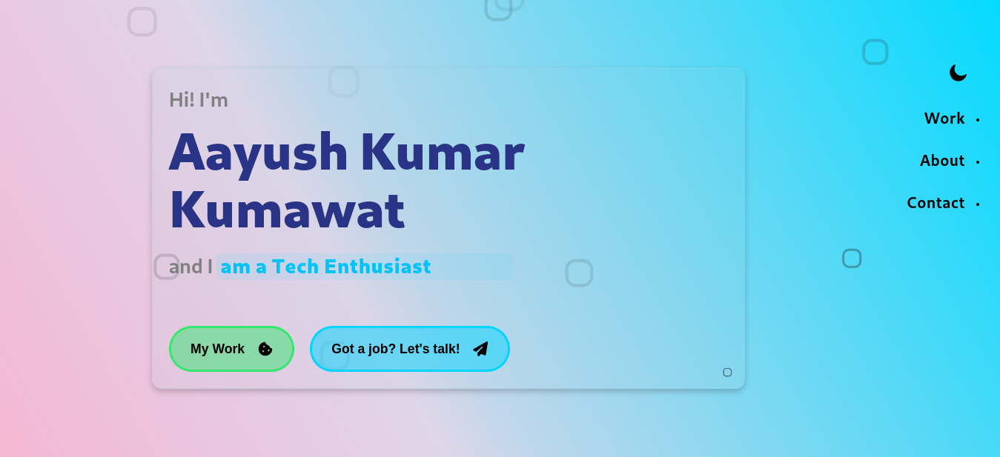

# Personal Portfolio Test

This project was created as a task given by my friend. It is a personal portfolio website build using React. It showcases my various projects, and skills.

## Features

- **Responsive Design**: The portfolio is fully responsive and works on all devices.
- **Project Showcase**: Display a list of projects with descriptions and links.
- **Skills Section**: Highlight key skills and technologies.
- **Contact Form**: It is dummy form which will be functional in future.

## Technologies Used

- React
- React Lazy Loading
- CSS

## Acknowledgement

- Thanks to my friend for providing the task and for encouragement and for always pushing me to achieve my best.